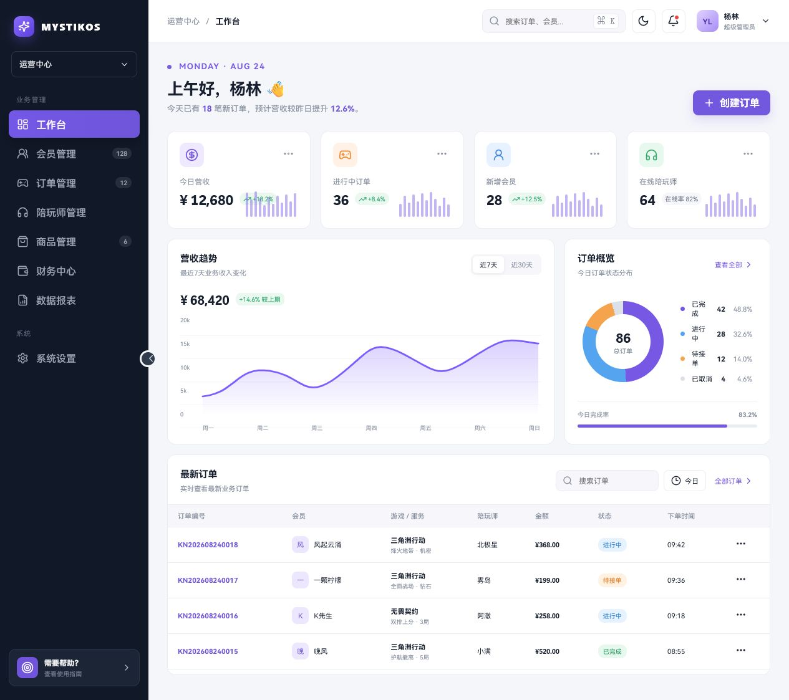

# Mystikos Admin

Mystikos Admin 是 Mystikos 项目的运营管理后台前端，面向会员、订单、陪玩师、财务和经营数据等业务场景。

项目采用 Vue 3、TypeScript、Vite 和 Naive UI 构建，界面与业务结构参考了 [Guyungy/Kuangniao](https://github.com/Guyungy/Kuangniao)，并重新设计为更轻量、统一的现代化管理后台。业务列表页的筛选、表格、分页与表单弹窗已统一使用 Naive UI。

> 当前版本已接入 Mystikos Server API 的登录认证、用户管理、陪玩师管理、陪玩申请与陪玩名片审核模块；总览、订单、商品、财务和报表仍使用本地模拟数据，其增删改、筛选和导出仅在浏览器端完成。系统设置入口已暂时屏蔽。

## 当前状态

| 项目 | 状态 |
| --- | --- |
| 总览 | 已完成前端原型 |
| 用户管理 | 已接入服务端分页、查询、新增、删除、封禁、角色与权限接口；筛选/表格为 Naive UI |
| 陪玩师管理 | 已接入服务端分页、统计、新增和删除接口；筛选/表格为 Naive UI |
| 陪玩申请 | 已接入申请查询、开始考核、录入考核结果；筛选/表格为 Naive UI |
| 陪玩名片审核 | 已接入展示卡分页查询与审核结果录入；支持预览封面/照片/音视频 |
| 订单管理 | 已使用 Naive UI 完成列表和本地交互 |
| 商品管理 | 已与前台商城商品字段对齐；列表经通用 DataTable 使用 Naive UI |
| 财务、报表 | 已完成列表和本地交互；列表经通用 DataTable 使用 Naive UI |
| 系统设置 | 已暂时屏蔽入口，访问 `/settings` 会回到总览 |
| 深浅主题与响应式布局 | 已完成 |
| 独立路由 | 已接入 Vue Router |
| Pinia 全局状态 | 已接入（主题、侧边栏、提示） |
| Axios 与环境变量 | 已接入统一响应、Bearer Token 与 Token 刷新 |
| ESLint / Prettier / 测试 | 已配置基础能力 |
| 后端接口与持久化 | 登录、退出、用户管理和陪玩师管理已接入，其余模块待接入 |
| 登录与权限控制 | 真实登录、路由守卫和用户角色/权限查询已完成 |

## 界面预览



## 已实现功能

- 运营总览与经营数据概览
- 今日营收、进行中订单、新增会员和陪玩数量统计
- 近 7 天、近 30 天营收趋势切换
- 今日订单状态分布与完成率展示
- 最新订单列表与关键字筛选
- 创建订单表单弹窗
- 订单管理页的 Naive UI 搜索、状态筛选、表格、分页、表单、删除确认和消息提示
- 手机号/邮箱密码登录、Token 刷新、路由守卫与服务端退出
- 用户、订单、陪玩师、商品、财务、报表独立路由页面（系统设置已屏蔽）
- 用户管理服务端分页、关键词/状态查询、新增、删除、封禁、角色分配/移除和权限查看
- 陪玩师管理服务端分页、关键词/接单状态查询、统计卡片、新增和删除
- 通用列表交互：新增、编辑、删除、关键词搜索、状态筛选、刷新和 CSV 导出
- 业务列表统一分页：默认每页 10 条，可切换 10/20/50/100，支持页码跳转
- 陪玩申请 / 名片审核待办提示：侧栏角标、顶栏铃铛与总览入口
- 侧边栏展开与收起（写入本地存储）
- 深色与浅色主题切换（写入本地存储）
- 桌面端和移动端响应式布局

## 技术栈

| 技术 | 用途 |
| --- | --- |
| Vue 3 | 前端视图与交互 |
| TypeScript | 类型检查与开发约束 |
| Vite | 开发服务器与生产构建 |
| Vue Router | 路由与页面拆分 |
| Pinia | 全局状态管理 |
| Axios | HTTP 请求封装 |
| Naive UI | 业务列表筛选、表格、分页、表单弹窗与根级主题、语言配置 |
| Lucide Vue Next | 页面图标 |
| ESLint / Prettier | 代码规范与格式化 |
| Vitest | 单元测试 |
| CSS | 页面布局、主题与响应式样式 |

### 字体策略

系统不依赖在线中文字体，按照以下顺序使用本机字体：

```text
HarmonyOS Sans SC → MiSans → PingFang SC → Microsoft YaHei UI
```

数字、金额和统计数据启用等宽数字特性，减少表格及指标变化时的视觉跳动。字体规则集中维护在 `src/styles/typography.css`。

## 环境要求

- Node.js 20.19 或更高版本，推荐使用 Node.js 22 LTS
- npm 9 或更高版本

可以通过以下命令检查本机环境：

```bash
node --version
npm --version
```

## 快速开始

进入前端目录：

```powershell
cd D:\MyDevelop\Mystikos\web\Admin
```

安装依赖：

```bash
npm install
```

复制环境变量示例（可选）：

```bash
copy .env.example .env.development
```

启动开发服务器：

```bash
npm run dev
```

默认访问地址：

```text
http://localhost:5173
```

开发服务器支持热更新，修改 `src` 目录中的代码后页面会自动刷新。

## 构建与预览

执行 TypeScript 类型检查并生成生产文件：

```bash
npm run build
```

构建产物会生成在 `dist` 目录中。

在本地预览生产构建：

```bash
npm run preview
```

## npm 命令

| 命令 | 说明 |
| --- | --- |
| `npm run dev` | 启动 Vite 开发服务器 |
| `npm run build` | 执行类型检查并构建生产版本 |
| `npm run preview` | 在本地预览生产构建 |
| `npm run lint` | 运行 ESLint 检查 |
| `npm run format` | 使用 Prettier 格式化代码 |
| `npm run format:check` | 检查代码格式 |
| `npm run test` | 运行 Vitest 单元测试 |
| `npm run test:watch` | 监听模式运行测试 |

## 环境变量

| 变量 | 说明 | 开发默认值 |
| --- | --- | --- |
| `VITE_API_BASE_URL` | 浏览器请求基础地址；留空时使用同域 `/api/v1` | 空 |
| `VITE_API_PROXY_TARGET` | Vite 开发代理目标地址 | `http://116.62.218.227:8099` |
| `VITE_APP_TITLE` | 浏览器标题前缀 | `Mystikos 运营中心` |
| `VITE_BASE_PATH` | 生产站点的部署子路径，必须以 `/` 开头和结尾 | `/` |

在代码中读取：

```ts
const apiBaseUrl = import.meta.env.VITE_API_BASE_URL
```

## 项目结构

```text
Admin/
├── src/
│   ├── api/                 # Axios 实例与接口封装
│   ├── components/          # 通用组件（表格、分页、统计卡片、状态标签、表单弹窗）
│   ├── composables/         # 组合式函数（列表 CRUD）
│   ├── layouts/             # 后台布局与导航
│   ├── mocks/               # 各模块模拟数据
│   ├── router/              # Vue Router 路由
│   ├── stores/              # Pinia 状态（主题、侧边栏、提示）
│   ├── styles/              # 样式体系（布局、业务、交互、字体）
│   ├── theme/               # 语义 Token 与 Naive UI 双主题覆盖
│   ├── types/               # TypeScript 业务类型
│   ├── utils/               # 通用工具（筛选、导出）
│   ├── views/               # 各业务模块页面
│   │   ├── dashboard/
│   │   ├── members/
│   │   ├── orders/
│   │   ├── workers/
│   │   ├── products/
│   │   ├── finance/
│   │   ├── reports/
│   │   └── settings/
│   ├── App.vue
│   └── main.ts
├── tests/                   # 跨文件样式与布局回归测试
├── ITERATIONS.md            # 总迭代记录、实施计划与验证结果
├── .env.development
├── .env.production
├── .env.example
├── eslint.config.js
├── dashboard-preview.jpg
├── index.html
├── package.json
├── tsconfig.json
└── vite.config.ts
```

## 路由说明

| 路径 | 页面 |
| --- | --- |
| `/login` | 登录 |
| `/` | 总览 |
| `/members` | 用户管理 |
| `/orders` | 订单管理 |
| `/workers` | 陪玩师管理 |
| `/companion-applications` | 陪玩申请 |
| `/companion-showcases` | 陪玩名片审核 |
| `/products` | 商品管理 |
| `/finance` | 财务中心 |
| `/reports` | 数据报表 |
| `/settings` | 已屏蔽，重定向至总览 |

## 当前页面交互

### 订单搜索

在总览“最新订单”区域输入订单编号、会员昵称、游戏名称、服务内容或陪玩师名称，可以即时筛选表格数据。

### 创建订单

点击页面右上方的“创建订单”按钮可以打开表单弹窗。目前提交操作仅关闭弹窗，不会保存数据或发送网络请求。

### 订单管理

`/orders` 是 Naive UI 第一阶段迁移试点，使用统一双主题 Token 下的搜索框、状态下拉框、按钮、数据表格、分页、表单弹窗、删除确认和消息提示。工具栏使用 `order-toolbar`；筛选控件高度 38px；状态标签带稳定语义类（info/warning/success/error）。关键词与状态筛选会即时更新当前本地列表；新增、编辑、删除、刷新和 CSV 导出继续复用现有列表逻辑。宽表格通过表格内部横向滚动展示，不会撑开页面主体。列表底部分页默认每页 10 条，可切换 10/20/50/100，并支持页码跳转。

订单数据仍来自 `src/mocks/orders.ts`，所有增删改只保存在当前页面的浏览器内存中，重新载入页面后会恢复演示数据；当前分页也是基于本地筛选结果计算，不代表已接入服务端分页。

### 用户管理

用户管理页面的数据来自 Mystikos Server API，筛选工具栏、数据表格与分页已迁移为 Naive UI（`list-toolbar` + `NDataTable` + `ListPagination`）。支持服务端分页（默认每页 10 条，可切换条数并跳页）、昵称/手机号/邮箱关键词搜索、账号状态筛选、创建时间范围（`NDatePicker`）筛选、新增用户、封禁、删除、角色分配与移除，以及查看服务端解析后的权限编码。筛选条件点击“查询”后统一提交，可通过“重置”恢复默认列表；删除和封禁使用 `NPopconfirm` 二次确认；新增用户时手机号与邮箱至少填写一项。

### 陪玩师管理

陪玩师管理页面调用 `/api/v1/manage/companions` 和 `/api/v1/manage/companions/stats`，列表筛选、表格与分页已迁移为 Naive UI（`NInput`/`NSelect`/`NDataTable`/`ListPagination`/`NPopconfirm`）。支持服务端分页（默认每页 10 条，可切换条数并跳页）、昵称/手机号/身份证号关键词防抖搜索、接单状态即时筛选、实时统计（陪玩师总数 / 接单中）、新增和删除。统计不再展示「当前在线」与「平均时薪」。新增表单可提交账号、等级、游戏标签 ID、小时费率、接单状态和结算资料；身份证和银行卡资料不会显示在列表中。后端当前未提供编辑接口，因此页面不显示编辑入口。

### 陪玩申请

陪玩申请页面调用 `/api/v1/manage/companion-applications`，列表筛选、表格与分页已迁移为 Naive UI；提交时间范围使用 `NDatePicker`（`yyyy-MM-dd'T'HH:mm`）。支持申请状态、提交时间范围及真实姓名/游戏昵称/联系电话/联系邮箱关键词筛选，点击「查询」提交、可「重置」。分页默认每页 10 条，可切换条数并跳页。列表按待考核 / 考核中优先、同状态按提交时间倒序展示。待考核申请可以开始线下考核，考核中的申请可以录入通过或不通过结果及审核意见；审核人默认使用当前登录管理员，通过后由服务端自动开通陪玩身份。

### 陪玩名片审核

陪玩名片审核为独立页面 `/companion-showcases`，对接 [陪玩名片审核 API](http://116.62.218.227:8099/doc.html#/%E5%90%8E%E5%8F%B0%E7%AE%A1%E7%90%86%20%C2%B7%20Manage/%E5%90%8E%E5%8F%B0%E7%AE%A1%E7%90%86%20-%20%E9%99%AA%E7%8E%A9%E5%90%8D%E7%89%87%E5%AE%A1%E6%A0%B8/review)：

- `GET /api/v1/manage/companion-showcases` 分页查询名片修订
- `PUT /api/v1/manage/companion-showcases/{revisionId}/review` 录入审核结果（`approved` + `comment`）

默认筛选「待审核」，支持关键词、状态、创建时间范围、分页条数切换与跳页。可查看封面、标语、简介、标签、照片与音视频链接；待审记录可填写意见后通过或驳回。

### 其他业务列表

商品、财务和报表页面通过通用 `DataTable` / `ModulePage` 使用 Naive UI 筛选、表格与导出，并支持以下本地模拟操作：

- 输入关键词实时筛选当前列表
- 根据状态筛选记录
- 新增记录并即时插入表格
- 编辑现有记录并即时更新表格
- 删除记录
- 刷新并恢复该模块的初始演示数据
- 将当前筛选结果导出为带 UTF-8 BOM 的 CSV 文件
- 本地分页：默认每页 10 条，可切换 10/20/50/100，支持页码跳转

上述操作目前仅修改浏览器内存中的数据。刷新页面或重新进入模块后会恢复初始模拟数据。

所有表单、角色管理和权限查看弹窗均使用 Naive UI（`NModal` + `NForm`），不会因点击外部遮罩而关闭，只能通过弹窗内的关闭、取消按钮或成功提交关闭，避免误触导致已填写内容丢失。业务筛选框与表单会统一关闭浏览器地址/账号自动填充建议；仅登录页保留浏览器账号密码填充。

### 商品管理

商品字段与 `D:\MyDevelop\Mystikos\web\Mystikos-web` 的奇物商店保持对应：

| 前台字段 | 含义 |
| --- | --- |
| `id` | 商品唯一编码 |
| `name` | 英文商品名称 |
| `category` | 商品分类 |
| `price` | 展示价格 |
| `image` | 商品图片地址 |
| `companion` | 推荐该商品的陪玩 |

管理后台在此基础上增加了 `stock` 和 `status`，用于库存及上下架管理。

## 登录说明

访问任意后台页面时，若未登录会自动跳转到 `/login`。

登录页调用 `POST /api/v1/auth/login`，支持手机号或邮箱配合密码登录。登录成功后，Access Token、Refresh Token 和用户信息会写入浏览器 `localStorage` 或 `sessionStorage`（取决于是否勾选“记住登录状态”）。顶部头像与总览问候会再请求 `GET /api/v1/auth/me`（角色）与 `GET /api/v1/profile/me`（昵称等资料）展示当前登录用户；无昵称时回退为手机号/邮箱或用户 ID。Access Token 失效时会调用 `POST /api/v1/auth/refresh-token` 刷新；刷新失败则清除登录状态并返回登录页。顶部头像菜单调用服务端退出接口并清除本地状态。

手机号与邮箱登录方式使用分段切换控件，当前方式通过紫色滑动高亮、文字强调及表单淡入效果进行反馈，同时支持键盘焦点和辅助技术识别。

管理员账号由 Mystikos Server 后端创建和维护，项目不再内置演示账号。

### 主题与侧边栏

点击顶部月亮或太阳图标可以切换深色与浅色主题；点击侧边栏圆形按钮可收起导航。偏好会写入 `localStorage`，刷新后保持。浅色/深色语义 Token 同时驱动 Naive UI 主题覆盖与布局 `--app-*` CSS 变量，页面背景、顶栏、Panel 和统计卡片会随主题切换。

## 后端 API 接入建议

Axios 实例位于 `src/api/http.ts`，已配置：

- 从 `VITE_API_BASE_URL` 读取基础地址
- 请求拦截器附加 `Authorization: Bearer <accessToken>`
- 401 响应自动使用 Refresh Token 刷新并重试一次
- `code/message/data` 统一响应结构由业务 API 解包

用户管理接口封装位于 `src/api/users.ts`，已接入 `/api/v1/manage/users` 下的分页查询、新增、删除、封禁、角色分配/移除和权限查询。页面使用服务端分页，不会把接口数据写入浏览器持久化存储。开发环境通过 Vite 将同域 `/api` 请求代理至 `VITE_API_PROXY_TARGET`，避免浏览器跨域预检被后端拒绝；生产部署也需要把同域 `/api` 反向代理到 Mystikos Server。

陪玩师管理接口封装位于 `src/api/companions.ts`，已接入分页查询、新增、删除和统计卡片接口。页面展示标签、时薪和服务绩效数据，敏感结算字段只随新增请求提交。

陪玩身份申请与陪玩名片审核接口同样封装于 `src/api/companions.ts`：前者含申请分页、开始考核与录入考核结果；后者含名片分页查询与审核结果录入。

后续可将各模块 `mocks/` 数据替换为 `src/api/` 下的真实接口调用，并在 Pinia store 中管理服务端状态。

## 后续开发计划

- [x] 接入真实登录、Token 刷新、服务端退出与路由守卫
- [x] 引入 Vue Router 并拆分业务页面
- [x] 引入 Pinia 管理全局状态
- [x] 封装 Axios 请求和错误处理
- [x] 接入用户管理 API
- [x] 接入陪玩师管理 API
- [x] 接入陪玩身份申请审核 API
- [ ] 接入订单和财务 API
- [ ] 完善订单创建、编辑、取消和状态流转
- [x] 增加关键词搜索、状态筛选和 CSV 导出
- [ ] 接入服务端分页和批量操作
- [x] 保存主题与侧边栏设置
- [x] 增加 ESLint、Prettier 和自动化测试
- [x] 完成 Naive UI 第一阶段基础接入与订单页迁移试点

## 文档维护约定

项目开发时必须同步维护 Markdown 文档，避免实现与说明脱节。

以下变更需要同步更新 `README.md`：

- 新增、删除或调整业务模块
- 修改页面交互、数据字段或状态流转
- 增加或移除 npm 依赖与运行命令
- 调整项目目录结构
- 修改环境变量、接口地址或部署方式
- 改变浏览器兼容范围或运行环境要求
- 完成或调整后续开发计划

提交功能前至少检查：已实现功能、项目结构、交互说明、后续计划和变更记录是否仍与代码一致。

## 变更记录

### 2026-08-25（主按钮品牌色修正）

- 深色主题 primary 调整为 `#8b6cff`，与侧栏/BrandMark 一致
- Naive Button 显式覆盖 `colorPrimary` / `textColorPrimary` 等，避免「新增陪玩师」等主按钮发灰发淡

### 2026-08-25（双主题 Token 与根级 Provider）

- 新增浅色/深色语义 Token（`src/theme/tokens.ts`）及 `--app-*` CSS 变量映射
- Naive UI 主题覆盖改为由 Token 生成浅色/深色两套配置，并随 Pinia 深浅主题同步切换
- `App.vue` 增加 `.theme-root`，与 `data-theme` 及根级 CSS 变量同步

### 2026-08-25（布局壳层语义表面）

- `.app` 兼容变量（`--bg/--card/--text/--muted/--line/--hover`）改为引用 `--app-*`，删除 `.app.dark` 表面硬编码
- 顶部栏、Panel、统计卡片统一使用 `--app-surface` / `--app-border` / 阴影 Token
- 布局回归测试增加语义变量桥接与样式源契约断言

### 2026-08-25（订单页视觉基准）

- Naive UI 主题覆盖补齐 Button/Input/Select/DataTable/Card/Pagination 等控件的边框、焦点与表面色；筛选控件高度 38px，表格正文字号 13px
- 订单工具栏增加 `order-toolbar`，导出改为次级按钮；表格/分页/弹窗消费 `--app-*`
- `StatusTag` 增加稳定语义类（`status-info/warning/success/error`），状态胶囊改用语义色 Token

### 2026-08-25（陪玩师 / 身份申请列表 Naive 化）

- 陪玩师管理列表筛选、`NDataTable`、分页与删除确认对齐用户管理页模式；关键词防抖与状态即时筛选逻辑保留
- 身份申请审核列表筛选（含 `NDatePicker`）、表格与分页对齐同一模式；查询/重置与审核弹窗业务逻辑不变
- 两页通知改为 `useMessage()`；宽表格使用 `:scroll-x` 与 `list-table-panel` 布局

### 2026-08-25（列表筛选与表格 Naive 化）

- 用户管理筛选工具栏改为可换行的 `list-toolbar`，修复筛选控件与表头重叠错乱
- 用户管理表格/分页迁至 `NDataTable` + `NPagination`；封禁/删除改用 `NPopconfirm`
- 通用 `DataTable` / `ModulePage` 迁至 Naive，商品/财务/报表/设置同步受益
- 订单页工具栏对齐同一套 `list-filters` 布局

### 2026-08-25（待办提示）

- 侧栏「陪玩申请 / 陪玩名片审核」显示真实待办角标（0 不显示，超过 99 为 99+）
- 顶栏铃铛可查看待办摘要并跳转；总览页同步展示待办入口
- 使用现有分页接口 `total` 汇总，每 2 分钟自动刷新，审核后强制刷新

### 2026-08-25（总览命名）

- 侧栏与路由标题「工作台」更名为「总览」

### 2026-08-25（独立陪玩名片审核页）

- 新增侧栏「陪玩名片审核」与路由 `/companion-showcases`
- 对接名片分页查询与审核录入，支持资料预览与驳回意见
- 从「陪玩申请」页移除嵌入的资料修改待审区块

### 2026-08-25（工作台/陪玩文案与设置屏蔽）

- 工作台第四卡改为「陪玩数量 / 新增陪玩」；订单概览「已取消」改为「已流单」并新增「已退款」
- 陪玩管理去掉当前在线与平均时薪，「服务中」改为「接单中」
- 「身份申请审核」更名为「陪玩申请」，待处理优先排序
- 侧栏暂时屏蔽系统设置，`/settings` 重定向到总览

### 2026-08-25（列表分页能力补齐）

- 统一 `ListPagination`：默认每页 10 条，可选 10/20/50/100，支持页码跳转
- 用户/陪玩师/身份申请为服务端分页；订单与通用 DataTable 为本地分页

### 2026-08-25（顶栏展示当前登录用户）

- 登录/刷新后合并 `/auth/me` 角色与 `/profile/me` 昵称，顶栏与总览问候显示真实用户
- 角色副标题改为中文标签（如「管理员」）

### 2026-08-25（页面标题叠字修复）

- 修正操作按钮移出后，`.business-title` 唯一子节点被误设为横向 flex，导致英文码、标题与说明叠在一起

### 2026-08-25（禁用业务表单浏览器自动填充）

- 根节点监听 DOM，统一关闭筛选框、业务表单的浏览器地址/账号建议
- 登录页保留 `data-allow-autofill`，账号密码仍可使用浏览器填充

### 2026-08-25（列表页操作区收拢）

- 将「刷新 / 新增」从页面大标题右侧移入列表工具栏首行，与列表标题对齐
- 筛选条件单独成行，避免标题区右侧悬空留白

### 2026-08-25（旧样式清理与工作台列表）

- 移除已无引用的 `.business-filters` / `.business-table` / 原生弹窗表单等兼容样式
- 工作台「创建订单」按钮与最新订单区改为 Naive 控件与 `NDataTable`
- 身份申请「开始考核」改为 `useDialog` 确认，不再使用 `window.confirm`

### 2026-08-25（全站表单弹窗 Naive 化）

- `RecordFormModal` 改为 `NModal` + `NForm`，商品/财务/报表/设置随 `ModulePage` 同步切换
- 用户管理（新增/角色/权限）、陪玩师新增、身份申请审核、工作台创建订单弹窗迁至 Naive UI
- 统一 `mask-closable=false` 与 `.app-form-*` 弹窗样式；用户/陪玩师/身份申请列表已另行迁移 Naive 表格

### 2026-08-24（Naive UI 第一阶段试点）

- 接入 Naive UI 根级中文、深浅主题和 Mystikos 紫色主题覆盖
- 订单管理页迁移搜索、状态筛选、表格、分页、表单弹窗、删除确认和消息提示，其他业务页面保持原实现
- 为主内容区和订单表格增加宽度收缩及局部滚动边界，避免宽表格触发全局横向滚动
- 增加主题 Provider、订单交互、可注入列表通知和布局边界测试；订单数据仍为本地 Mock

### 2026-08-24（全局横向滚动修复）

- 解除管理后台页面壳层的固定最小宽度，避免中小尺寸视口出现全局横向滚动条
- 保留业务表格容器的局部横向滚动，宽表格不会撑开整个页面
- 增加管理布局最小宽度回归测试

### 2026-08-24（陪玩身份申请审核）

- 新增 `/companion-applications` 身份申请审核页面及侧栏入口
- 接入申请分页查询、开始考核和录入考核结果接口，审核人默认取当前登录管理员
- 支持状态、提交时间范围和关键词筛选，以及按申请状态控制审核操作

### 2026-08-24（用户筛选条件补全）

- 用户管理补齐接口提供的创建时间起止筛选，与关键词和账号状态统一查询及重置
- 分页参数继续由分页器管理，筛选请求完整传递 `status`、`createdFrom`、`createdTo` 和 `keyword`
- 全局原生下拉框及选项字号统一提升至 14px，控件高度不低于 40px

### 2026-08-24（全局字体可读性）

- 统一提升导航、正文、表格、表单、弹窗、状态标签和登录页的字号层级
- 辅助文字最低统一为 12px，并适度增加表格行高及输入、筛选和导航控件高度
- 保留窄屏标题的独立字号规则，避免放大后产生布局拥挤

### 2026-08-24（登录方式切换反馈）

- 手机号与邮箱登录方式改为带滑动高亮的分段切换控件
- 增加表单淡入、键盘焦点和无动画偏好适配，使当前登录方式更容易识别

### 2026-08-24（弹窗防误关）

- 统一取消点击弹窗外部遮罩关闭的行为
- 保留右上角关闭、取消/关闭按钮和提交成功关闭
- 增加通用记录弹窗的遮罩点击回归测试

### 2026-08-24（陪玩师管理 API）

- `/workers` 改为服务端分页，接入关键词、接单状态筛选和真实统计卡片
- 接入新增和删除陪玩师接口，删除前进行二次确认
- 新增表单覆盖账号、标签、时薪、状态和结算资料，列表不展示身份证及银行卡信息
- 移除旧陪玩师 Mock 与无后端支持的编辑入口
- 增加陪玩 API 契约和标签 ID 解析测试

### 2026-08-24（生产子路径部署）

- 增加 `VITE_BASE_PATH`，支持将管理后台部署到 `/manage/` 等 Nginx 子路径
- Vue Router 使用 Vite 构建基路径，直接刷新子路由时可由站点入口正确接管

### 2026-08-24（真实登录与用户管理）

- 登录页改为调用 Mystikos Server API，支持手机号/邮箱密码登录、Access/Refresh Token 持久化与服务端退出
- Axios 增加统一业务响应解包、Bearer Token 和 401 自动刷新重试
- `/members` 改为用户管理，接入服务端分页、搜索、状态筛选、新增、删除、封禁、角色管理和权限查看
- 开发环境通过 Vite 同域代理连接 `http://116.62.218.227:8099`，生产环境要求配置同域 `/api` 反向代理
- 增加认证、统一响应和用户 API 契约测试

### 2026-08-24（登录页）

- 新增 `/login` 登录页面，接入 Pinia 认证状态与路由守卫
- 支持演示账号登录、记住登录状态、退出登录
- 顶部用户信息改为读取登录态

### 2026-08-24（字体修复）

- 修正样式加载顺序，避免布局样式覆盖中文字体栈，恢复 HarmonyOS Sans SC → MiSans → PingFang SC → Microsoft YaHei UI

### 2026-08-24（架构重整）

- 接入 Vue Router，拆分工作台与各业务模块独立页面
- 抽取 `AdminLayout` 后台布局与侧边栏导航
- 为各模块建立独立 `types/`、`mocks/` 与表单字段定义
- 抽取 `StatCards`、`StatusTag`、`DataTable`、`RecordFormModal` 通用组件
- 接入 Pinia（主题、侧边栏、操作提示）与 Axios 环境变量封装
- 重整样式目录为 `src/styles/`
- 增加 ESLint、Prettier、Vitest 与基础单元测试

### 2026-08-24

- 初始化 Vue 3、TypeScript 和 Vite 管理后台
- 完成运营工作台、经营指标、趋势图和订单概览
- 增加会员、订单、陪玩师、财务、报表及系统设置页面
- 参考前台奇物商店增加商品管理模块
- 为业务列表增加新增、编辑、删除、搜索、状态筛选、刷新和 CSV 导出
- 调整中文字体方案及数字、金额的排版层级
- 完善项目开发、API 接入和文档维护说明

## 说明

参考项目提供了后台系统的业务导航与功能思路。本项目当前代码和视觉样式针对 Mystikos 重新实现，未直接依赖参考项目的后端服务。
